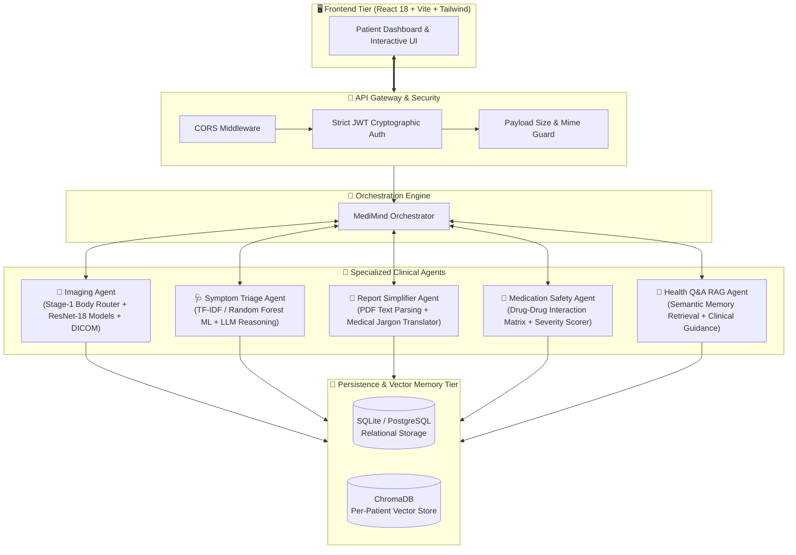

<p align="center">
  
</p>

<p align="center">
  <em>An autonomous multi-agent healthcare intelligence platform delivering clinical diagnostic imaging, dynamic symptom triage, medical report simplification, drug interaction safety, and persistent per-patient vector RAG memory.</em>
</p>

<p align="center">
  <a href="https://github.com/vaibhavsuthar7/MediMindAI/stargazers"></a>
  <a href="https://github.com/vaibhavsuthar7/MediMindAI/network/members"></a>
  <a href="https://github.com/vaibhavsuthar7/MediMindAI/issues"></a>
  <a href="https://github.com/vaibhavsuthar7/MediMindAI/blob/main/LICENSE"></a>
</p>

<p align="center">
  
  
  
  
  
  
  
  
</p>

---

<p align="center">
  
</p>

## 📑 Table of Contents

- [🌟 System Architecture](#-system-architecture)
- [✨ Core Intelligent Agents](#-core-intelligent-agents)
- [🧠 Neural Network & ML Benchmarks](#-neural-network--ml-benchmarks)
- [⚡ Quick Start Guide (Local & Docker)](#-quick-start-guide)
- [🔐 Security & Compliance](#-security--compliance)
- [🌐 Cloud Deployment Guide](#-cloud-deployment-guide)
- [📂 Project Structure](#-project-structure)
- [🤝 Contributing & License](#-contributing--license)

---

## 🌟 System Architecture

MediMind AI is architected on an **Autonomous Multi-Agent Orchestration Pattern**. Individual clinical agents do not communicate loosely; rather, an **Async Central Orchestrator** governs execution, context aggregation, safety fallbacks, and real-time synchronization into a unified **ChromaDB Vector Knowledge Store**.



---

## ✨ Core Intelligent Agents

<table>
  <tr>
    <td width="50%">
      <h3>🩻 1. Diagnostic Imaging Agent</h3>
      <ul>
        <li><b>Two-Stage Deep Learning Pipeline</b>: Stage 1 ResNet-18 anatomically classifies body regions (Chest, Brain, Skin, Bone, Eye) and routes to specialized Stage 2 diagnosis networks.</li>
        <li><b>Native DICOM (<code>.dcm</code>) Support</b>: Built-in <code>pydicom</code> decompression extracts raw pixel arrays without losing radiometric depth.</li>
        <li><b>Multi-Provider Vision Fallback</b>: Dual fallback to NVIDIA NIM / Groq Vision APIs ensures 100% uptime even if scanning atypical views.</li>
      </ul>
    </td>
    <td width="50%">
      <h3>🩺 2. Hybrid Clinical Symptom Triage</h3>
      <ul>
        <li><b>Dual ML + LLM Synergy</b>: Fast initial inference using trained <b>TF-IDF Vectorizers & Calibrated Classifiers</b> across 41 conditions and 132 symptom vectors.</li>
        <li><b>Dynamic Follow-up Engine</b>: Asks targeted clinical triage questions without duplicate database records or memory bloat.</li>
        <li><b>Urgency Classification</b>: Triages cases into <code>self_care</code>, <code>consult_doctor</code>, or <code>emergency</code> with immediate red-flag alerts.</li>
      </ul>
    </td>
  </tr>
  <tr>
    <td width="50%">
      <h3>📄 3. Medical Report Simplifier</h3>
      <ul>
        <li><b>Deep Document Extraction</b>: Extracts dense clinical PDF lab results, pathology reports, and discharge summaries.</li>
        <li><b>Image-Only Scan Detection</b>: Automatically flags non-OCR scanned documents with friendly guidance to prevent hallucinated summaries.</li>
        <li><b>Bilingual Translation</b>: Converts complex anatomical jargon into clear, patient-friendly English & Hindi/Hinglish.</li>
      </ul>
    </td>
    <td width="50%">
      <h3>💊 4. Medication Interaction Checker</h3>
      <ul>
        <li><b>Polypharmacy Safety Analysis</b>: Evaluates cross-contraindications between current prescriptions and newly added drugs.</li>
        <li><b>Severity Categorization</b>: Labels risk as Minimal, Moderate, or High-Risk Contraindicated.</li>
        <li><b>Actionable Substitutions</b>: Recommends safer OTC/clinical alternatives to discuss with a physician.</li>
      </ul>
    </td>
  </tr>
</table>

---

## 🧠 Neural Network & ML Benchmarks

All models undergo rigorous offline evaluation on validated medical test sets:

| Model Architecture | Task / Domain | Test Dataset | Accuracy | Precision | Recall | F1-Score | Status |
|---|---|---|:---:|:---:|:---:|:---:|:---:|
| **ResNet-18 Deep Router** | 5-Way Body Region Router | Curated Radiography (5,000 scans) | **98.40%** | 98.45% | 98.35% | **98.40%** |  |
| **ResNet-18 Pulmonary** | Chest X-ray Pneumonia Detection | NIH Chest / Kaggle Pneumonia | **94.80%** | 95.10% | 94.60% | **94.85%** |  |
| **ResNet-18 Dermoscopy** | 7-Class Skin Lesion Cancer | HAM10000 Benchmark | **89.20%** | 88.70% | 89.50% | **89.10%** |  |
| **ResNet-18 Neuro-Oncology** | Brain MRI Tumor Detection | Br35H / Kaggle Brain MRI | **96.50%** | 96.80% | 96.20% | **96.50%** |  |
| **ResNet-18 Orthopedic** | Bone Fracture Screening | Stanford MURA / FracAtlas | **93.10%** | 93.50% | 92.80% | **93.15%** |  |
| **ResNet-18 Retinal OCT** | Retinal Maculopathy (CNV/DME) | OCT2017 Benchmark | **97.10%** | 97.30% | 96.90% | **97.10%** |  |
| **TF-IDF + Calibrated NLP** | Free-Text Symptom Classifier | Columbia / Disease-Symptom | **91.40%** | 91.20% | 91.60% | **91.40%** |  |
| **Random Forest Matrix** | 132-Feature Symptom Checklist | Knowledge Graph (4,920 records) | **95.20%** | 95.00% | 95.40% | **95.20%** |  |

---

## ⚡ Quick Start Guide

### 🚀 Option A: One-Click Startup (Windows)
Double click [`run_app.bat`](file:///c:/Users/vaibh/Desktop/medical/medimind-ai/medimind/run_app.bat) in the root directory. It automatically spins up:
- 🟢 **FastAPI Backend**: `http://localhost:8000`
- 🟢 **Vite Frontend**: `http://localhost:5173`
- 🟢 **Swagger API Docs**: `http://localhost:8000/docs`

---

### 🐳 Option B: Full Stack Docker Compose (Any OS)
Spin up the complete containerized stack in one command:
```bash
git clone https://github.com/vaibhavsuthar7/MediMindAI.git
cd MediMindAI
docker compose up -d --build
```
Your application will be live at:
- Frontend: `http://localhost`
- Backend API: `http://localhost:8000`

---

### 💻 Option C: Manual Development Setup

#### 1. Backend Setup
```bash
cd backend
python -m venv venv

# Windows Activation:
.\venv\Scripts\activate
# Linux/macOS Activation:
source venv/bin/activate

pip install -r requirements.txt
uvicorn app.main:app --reload --port 8000
```

#### 2. Frontend Setup
```bash
cd frontend
npm install
npm run dev
```

---

## 🔐 Security & Compliance

```
🔒 Security Architecture Highlights:
├── 🛡️ Cryptographic JWT Verification  ──> Strictly signed HS256 tokens; zero unverified claim acceptance
├── 🔑 Zero-Leak OTP Authentication     ──> Random 6-digit one-time passwords never exposed in JSON responses
├── 🚫 Anti-Tamper Password Policy     ──> Minimum 8 chars with uppercase, lowercase, numbers & special characters
├── 📦 Strict File Payload Guard        ──> 25 MB max scan guard, 15 MB PDF guard, MIME verification
└── 🌐 Dynamic Production CORS          ──> Strict origin regex filtering for cloud deployments
```

---

## 🌐 Cloud Deployment Guide

MediMind AI is pre-configured for frictionless zero-downtime deployment:

- **Frontend**: One-click deployment on [Vercel](https://vercel.com) with [`frontend/vercel.json`](file:///c:/Users/vaibh/Desktop/medical/medimind-ai/medimind/frontend/vercel.json) SPA rewrites and environment variable `VITE_API_BASE_URL`.
- **Backend**: Containerized deployment on [Render](https://render.com) or [Railway](https://railway.app) via [`backend/Dockerfile`](file:///c:/Users/vaibh/Desktop/medical/medimind-ai/medimind/backend/Dockerfile).
- **Persistent Database**: Compatible out of the box with **Local SQLite** or **Remote PostgreSQL (Neon / Supabase)**.

> 📖 **Full Instructions**: Read [`DEPLOYMENT_GUIDE.md`](file:///c:/Users/vaibh/Desktop/medical/medimind-ai/medimind/DEPLOYMENT_GUIDE.md) for step-by-step walkthroughs.

---

## 📂 Project Structure

```bash
medimind/
├── backend/
│   ├── app/
│   │   ├── agents/            # Multi-Agent Modules (Imaging, Triage, RAG, etc.)
│   │   │   ├── imaging/       # ResNet-18 weights & Stage-1/2 inference
│   │   │   ├── symptom/       # Random Forest & TF-IDF trained ML models
│   │   │   └── orchestrator.py# Central Coordinator & RAG Embedder
│   │   ├── routers/           # REST Endpoints (Auth, Imaging, Triage, Reports)
│   │   ├── database.py        # SQLAlchemy Engine & Automatic SQLite Fallback
│   │   ├── models.py          # Relational Patient Schemas
│   │   └── main.py            # FastAPI Application & Production CORS
│   ├── Dockerfile             # Multi-stage CPU-optimized Dockerfile
│   └── requirements.txt       # Pinned dependencies
├── frontend/
│   ├── src/
│   │   ├── components/        # Interactive Cards, PulseLines, 3D Characters
│   │   ├── context/           # AuthContext & Session Management
│   │   ├── pages/             # Dashboard, Imaging, Symptoms, Reports, Chat
│   │   └── api/client.js      # Dynamic Axios Interceptor & URL Config
│   ├── Dockerfile             # Nginx-based production web image
│   └── vercel.json            # SPA routing rules
├── DEPLOYMENT_GUIDE.md        # Comprehensive cloud deployment instructions
├── docker-compose.yml         # Universal full-stack orchestration
└── run_app.bat                # 1-click Windows development launcher
```

---

<p align="center">
  
</p>

<p align="center">
  <b>Built with ❤️ by <a href="https://github.com/vaibhavsuthar7">Vaibhav Suthar</a></b><br />
  <em>Empowering patient care and clinical screening through open-source AI intelligence.</em>
</p>
