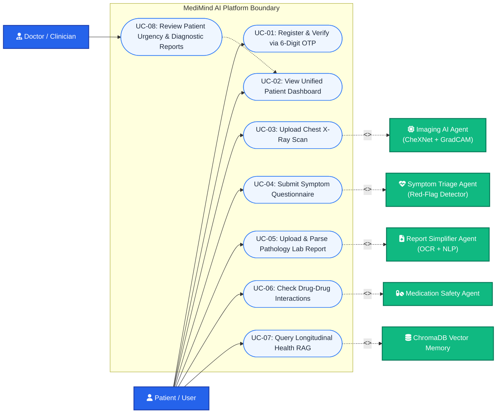
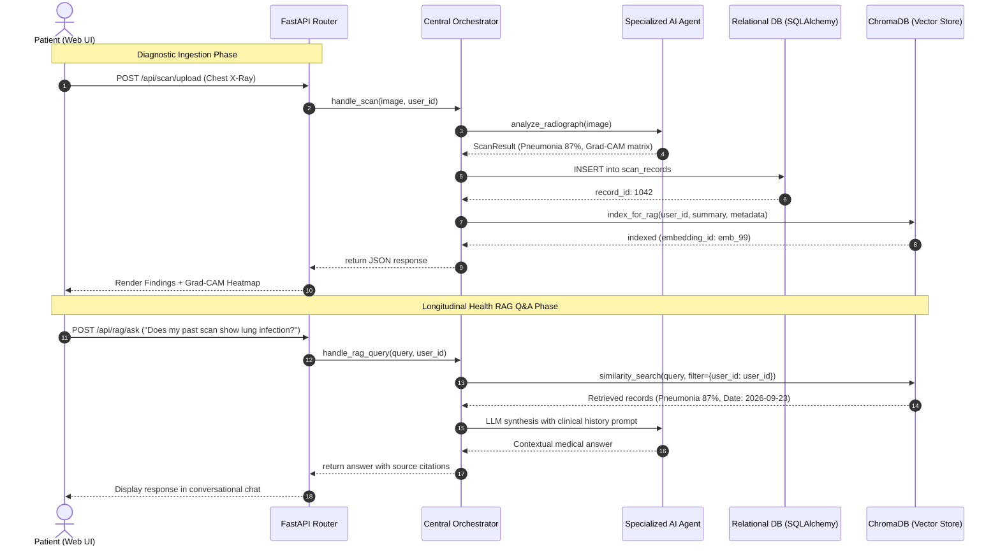
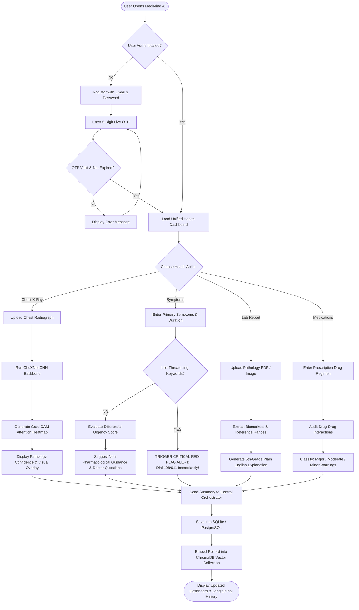
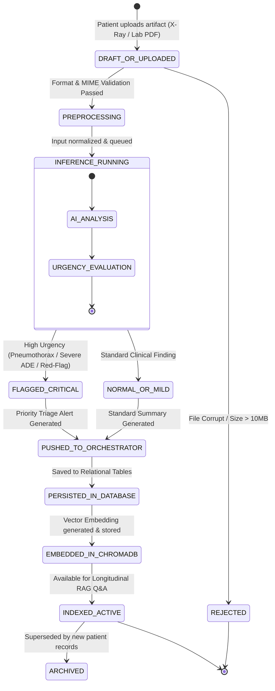
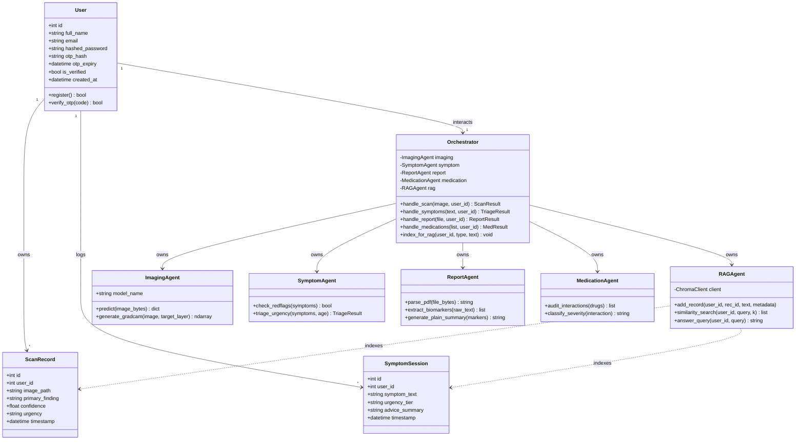
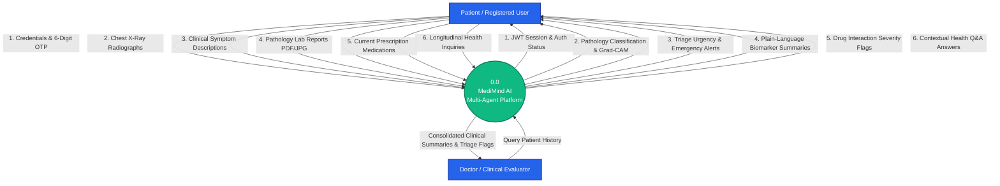
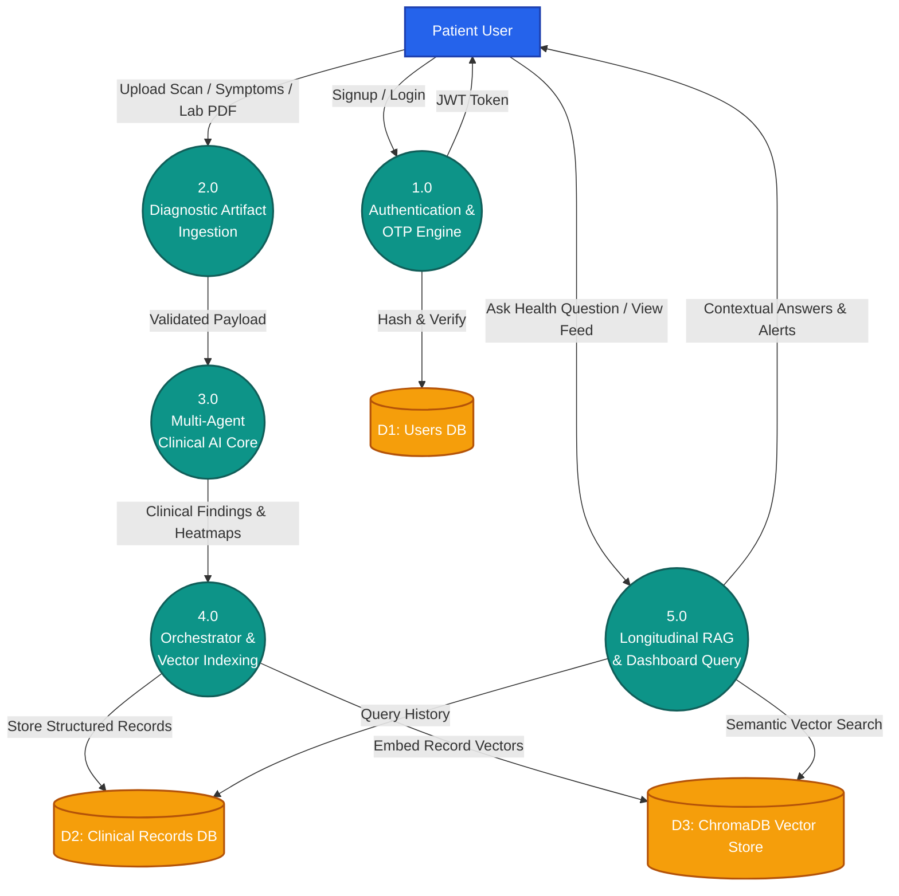
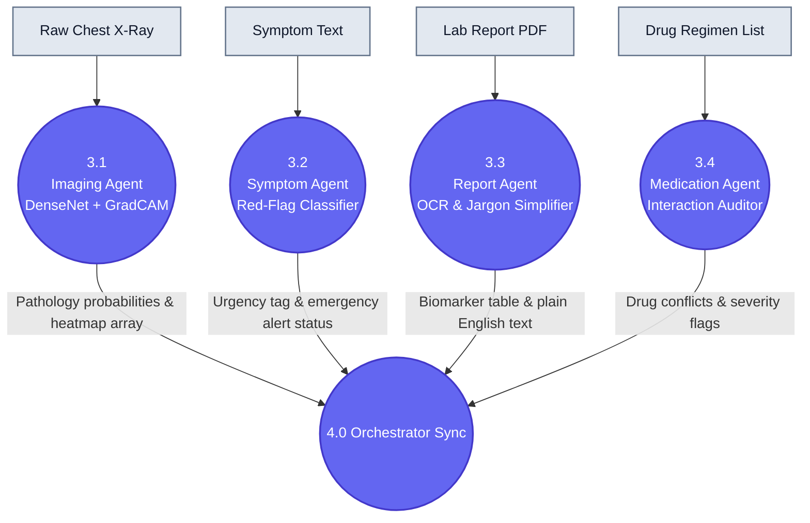
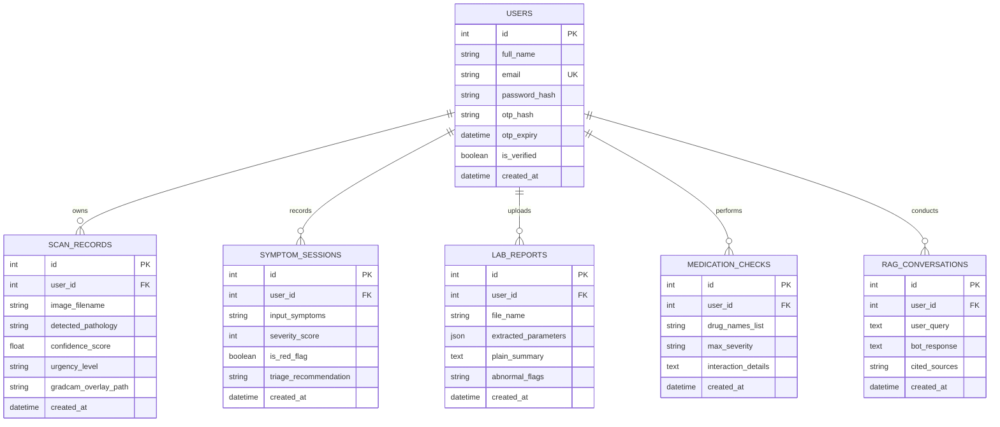

# MediMind AI — Draw.io / Mermaid Diagram Codes
> **Instructions for Draw.io (https://app.diagrams.net):**
> 1. Open [draw.io](https://app.diagrams.net)
> 2. Top menu par click karo: **Arrange** -> **Insert** -> **Advanced** -> **Mermaid**
> 3. Neeche diya gaya code paste karo aur **Insert** par click karo! Diagram turant draw ho jayega!
> 4. You can also export as PNG / SVG / PDF directly into your Word Report!

---

## 1. Figure 7.1.1: Use Case Diagram

---

## 2. Figure 7.1.2: Sequence Diagram (Diagnostic & Cross-Agent RAG Pipeline)

---

## 3. Figure 7.1.3: Activity Diagram (Patient Journey & Clinical Triage)

---

## 4. Figure 7.1.4: State Chart Diagram (Diagnostic Report Lifecycle)

---

## 5. Figure 7.1.5: Class Diagram

---

## 6. Figure 7.1.6.1: Level-0 DFD (Context Level)

---

## 7. Figure 7.1.6.2: Level-1 DFD (Subsystem Decomposition)

---

## 8. Figure 7.1.6.3: Level-2 DFD (Multi-Agent Evaluation Core)

---

## 9. Figure 7.1.7: Entity-Relationship (E-R) Diagram

